# 「刚刚好」产品介绍

> 一款以手机桌面为入口的 AI 生活规划应用：把计划变成桌面上“现在能做什么”，到点自动提醒、自动开始，并让 AI 小宠陪你把日子过成刚刚好的节奏。

## 产品定位

「刚刚好」是一款面向 Android 竖屏手机的本地生活规划 App（Android 10–16）。它不要求用户频繁打开主应用，而是把“今天能做什么、现在该做什么”直接放到桌面小组件、系统提醒和悬浮小宠上。数据默认保存在本机，AI 只在用户授权并配置接口后参与规划与聊天。

一句话：它不是又一张待办清单，而是一个会提醒你、会问你、会帮你开始任务的桌面伙伴。

## 核心功能

1. 桌面即入口
   - 透明今日计划组件直接显示当前任务、可选任务、全天安排与充实度。
   - 组件可点击操控：开始、暂停、完成、推迟，无需打开主 App。

2. 四象限计划
   - 重要且紧急 / 重要不紧急 / 不重要但紧急 / 不重要也不紧急。
   - 四象限同屏独立滚动，支持长按拖动换区、区内排序。
   - 计划名称、目标、时长、绑定 App、时间安排独立管理。

3. 闹钟式任务触发
   - 计划到点像闹钟一样响铃并持续提醒，可一键关闭。
   - 铃声支持 App 内置、系统铃声，也可选择本机本地音乐。
   - 开启后自动开始任务、自动打开绑定的 App，并用浮层清楚显示“现在做什么、目标是什么”。

4. AI 分析
   - 内置聊天式 AI，可整理计划、建议象限、检查冲突与过载。
   - 支持 DeepSeek 官方与自定义 OpenAI 兼容接口，API Key 本地加密保存。
   - 所有建议都需用户确认后才会写入，AI 不擅自修改计划。

5. 动态桌宠“小满”
   - 原创 Lottie 分层矢量角色，不是图片拼接，动作连贯、可随时开关。
   - 会结合时间与计划主动提醒、偶尔提问，点击即可展开浮窗聊天。
   - 浮窗内可直接唤起输入法打字交流，无需跳转主 App。

6. 充实度与反馈
   - 每天最多 5 格充实度，完成一件任务后由用户填写，超出部分继续累计。
   - 完成有奖励音效，任务开始有清脆提示，反馈克制、不制造焦虑。

## 技术亮点

- Kotlin + Jetpack Compose + Material 3，仅竖屏手机适配（Android 10–16）。
- Room 数据库（含 v8 迁移）+ DataStore 设置。
- AlarmManager 精确提醒 + WorkManager 恢复 + 开机重建提醒。
- Jetpack Glance / RemoteViews 透明可滚动桌面组件。
- Lottie 桌宠动画 + 悬浮窗浮窗聊天。
- OkHttp + Kotlin Serialization 接入 OpenAI 兼容接口。
- Android Keystore + AES-GCM 保护 API Key，备份不含密钥。

## 功能演示

以下 16 张截图与 2 段视频均为真实设备功能演示。

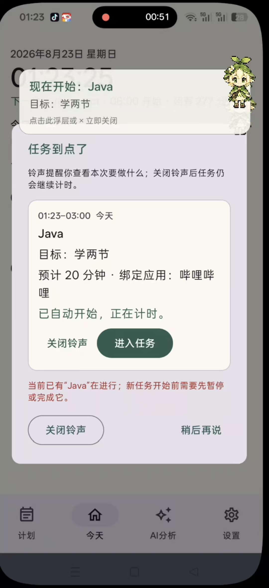

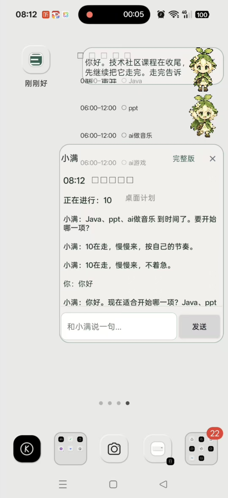

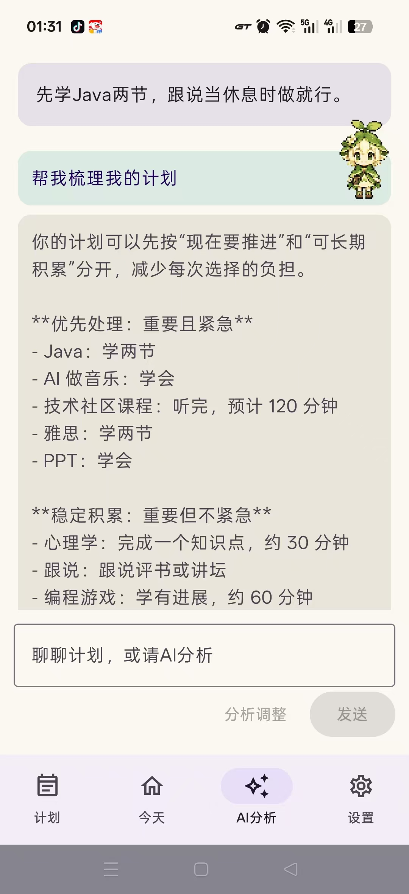

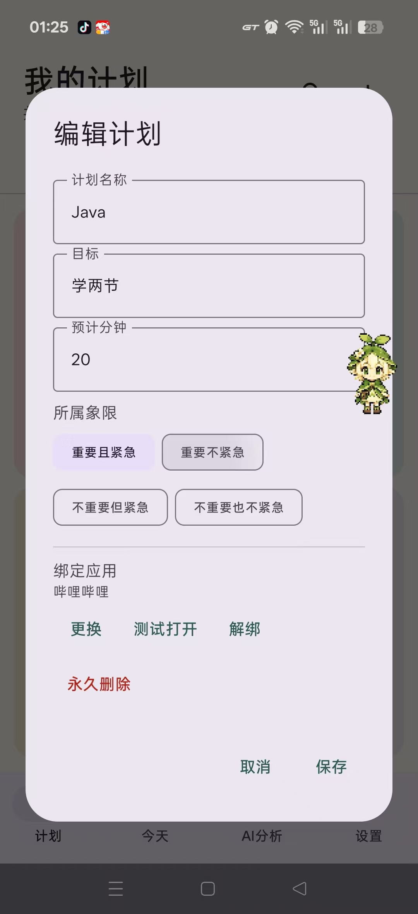

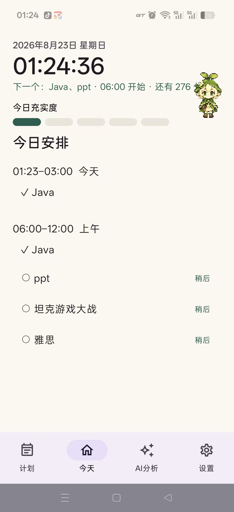

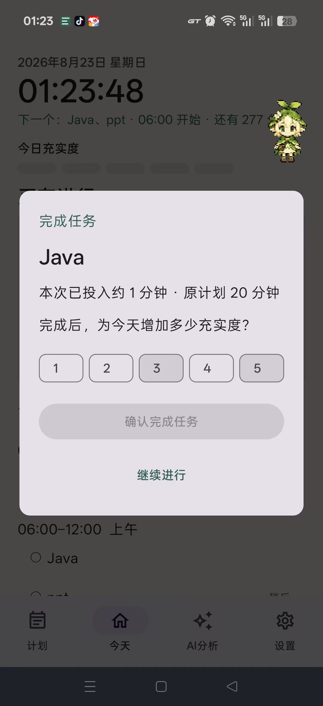

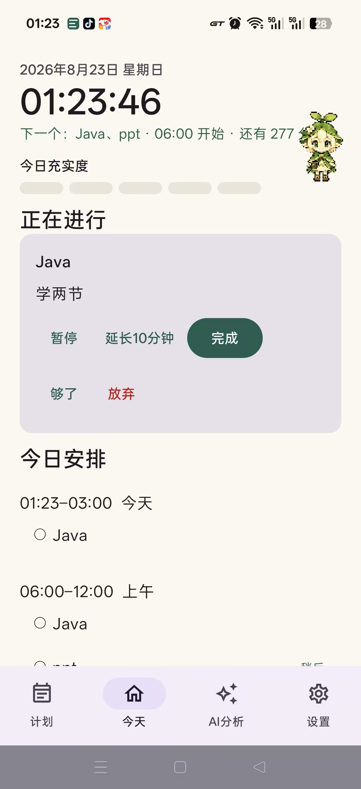

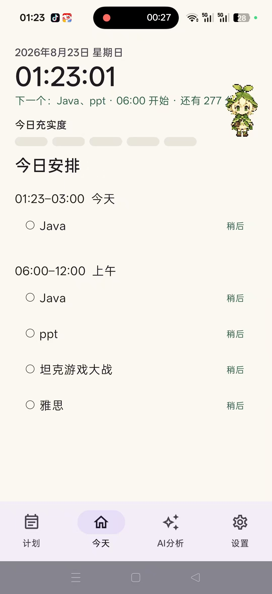

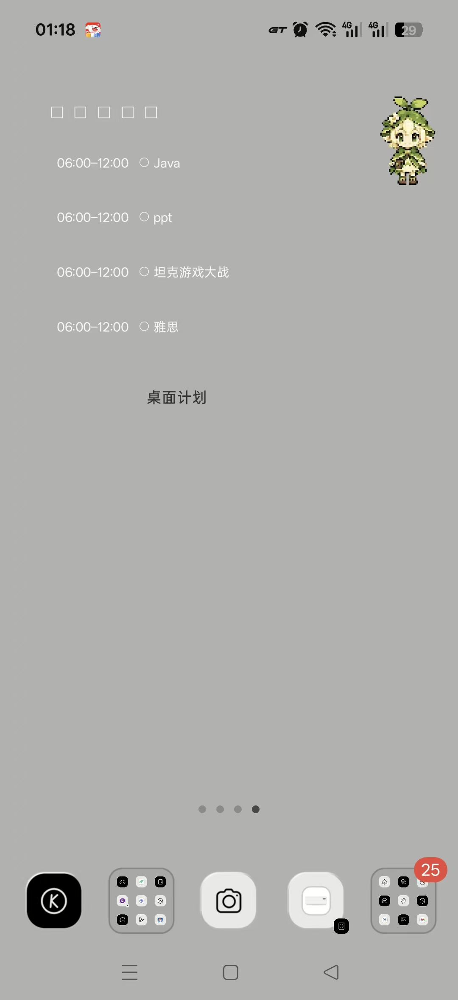

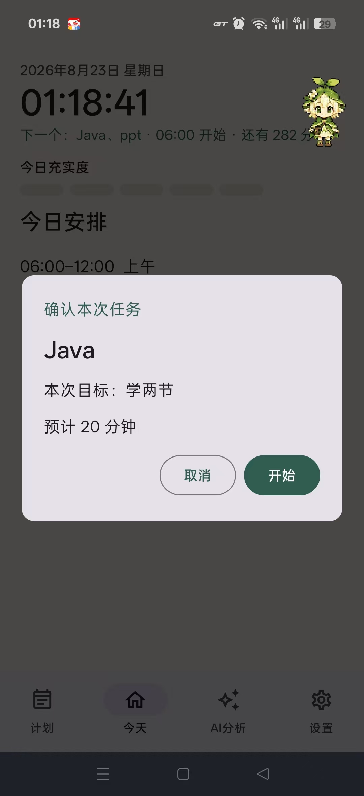

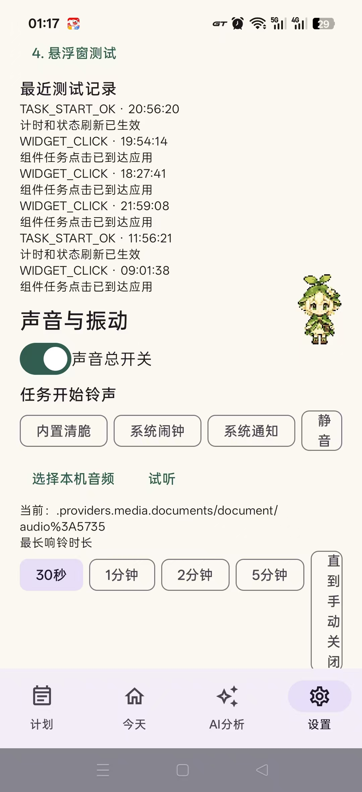

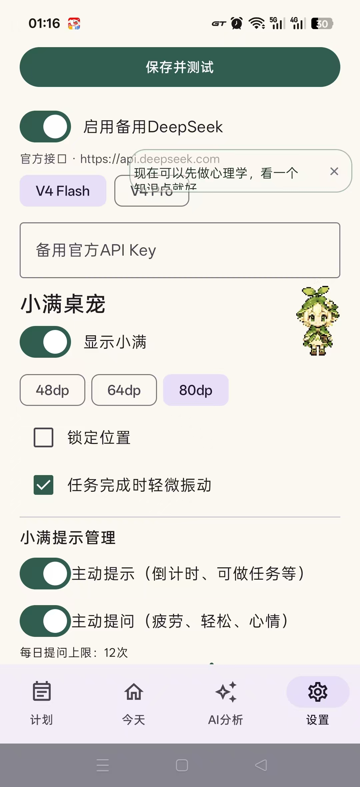

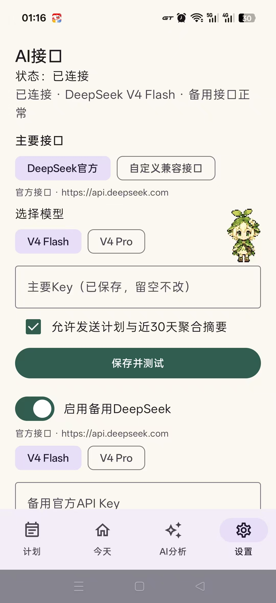

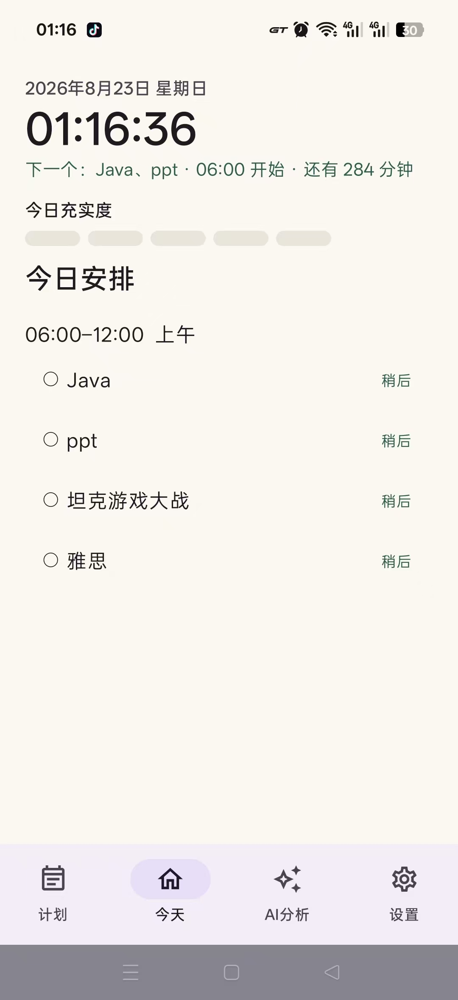

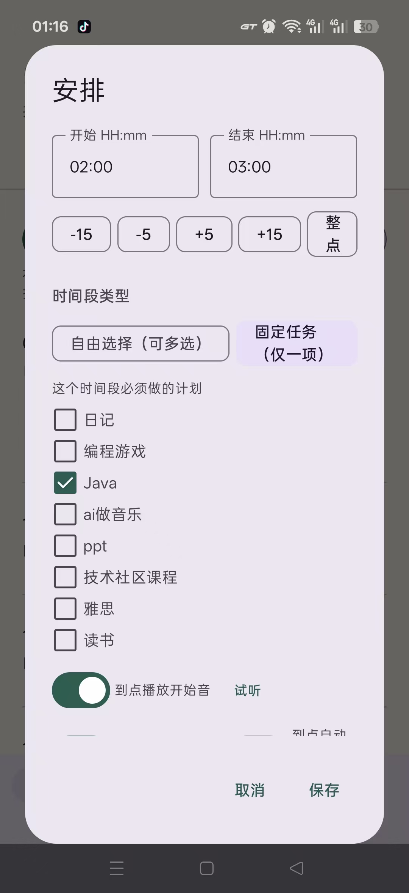

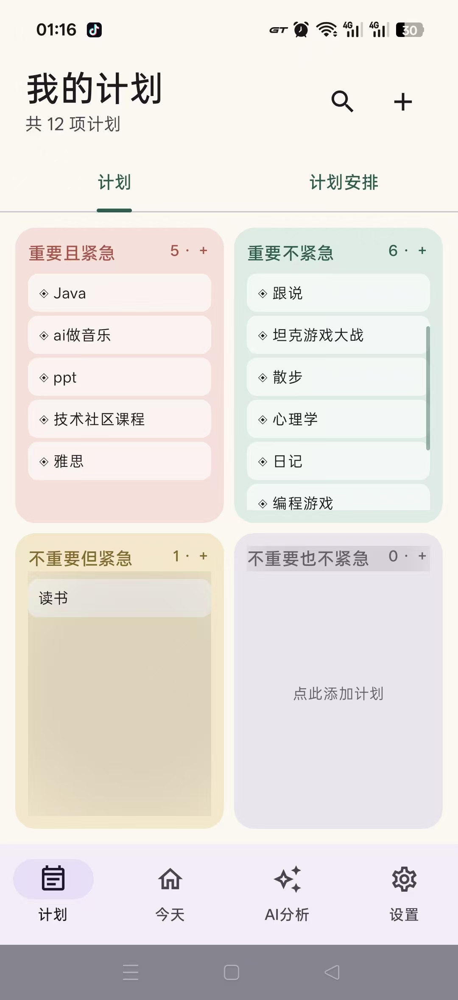

## 交付信息

- 正式签名演示包：`release/JustEnough-v1.4.7-release.apk`
- 完整可构建源码：`source/`
- 隐私与验证说明：`source/PRIVACY.md`、`source/VERIFICATION.md`
